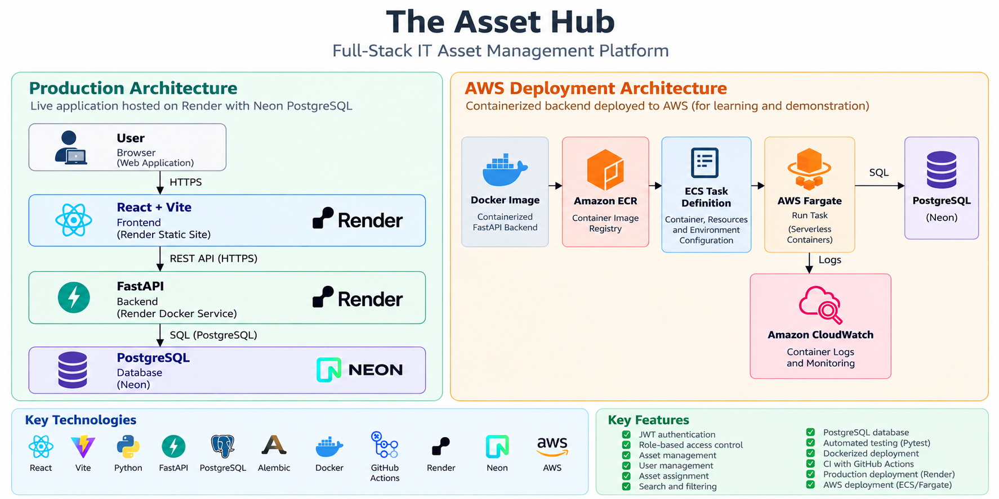
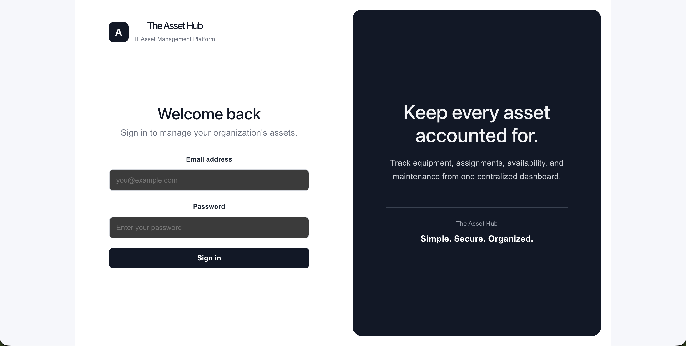
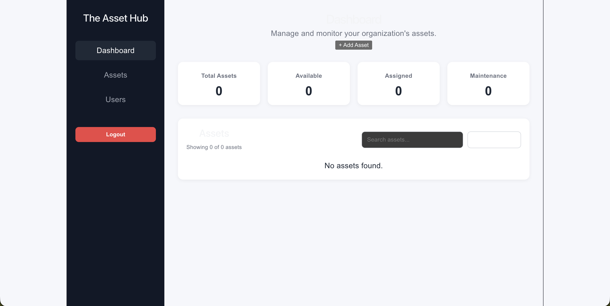
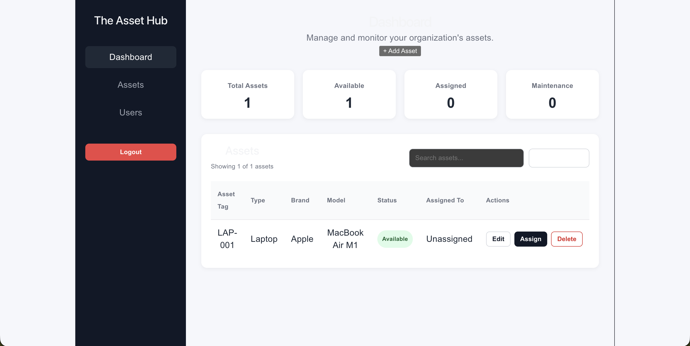
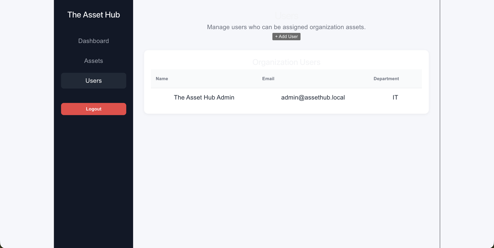

# The Asset Hub

The Asset Hub is a full-stack IT asset management platform designed to help organizations track hardware, manage users, and control asset assignments from a centralized dashboard.

The project was built to simulate a real-world internal IT system while giving me hands-on experience with full-stack development, relational databases, authentication, testing, containerization, CI, and cloud deployment.

## Live Demo

**Application:** https://assethub-r9pa.onrender.com

> The application is hosted on Render's free tier, so the backend may take a short time to wake up after a period of inactivity.

## Features

- Secure JWT-based authentication
- Role-based access control (RBAC)
- Create, view, update, and delete IT assets
- Create and manage users
- Assign and unassign assets to users
- Track asset status
- Search and filter asset records
- Input validation and API error handling
- PostgreSQL database persistence
- Database schema management with Alembic migrations
- Automated backend testing
- Dockerized frontend and backend
- Continuous integration with GitHub Actions

## Tech Stack

### Frontend
- React
- Vite
- JavaScript
- CSS

### Backend
- Python
- FastAPI
- SQLAlchemy
- Pydantic
- JWT Authentication

### Database
- PostgreSQL
- Alembic
- Neon PostgreSQL

### Testing & DevOps
- Pytest
- Docker
- Docker Compose
- GitHub Actions

### Cloud & Deployment
- Render
- Neon
- Amazon Web Services (AWS)
- Amazon ECS
- AWS Fargate
- Amazon ECR
- Amazon CloudWatch

## Architecture


## Screenshots

### Login


### Dashboard


### Asset Management


### User Management


### Production

```text
User
 │
 ▼
React / Vite Frontend
(Render Static Site)
 │
 │ HTTPS / REST API
 ▼
FastAPI Backend
(Render Docker Service)
 │
 ▼
Neon PostgreSQL
```

### AWS Deployment Exercise

The Asset Hub backend was also independently containerized and deployed to AWS to gain hands-on experience with container orchestration and cloud infrastructure.

```text
Docker Image
     │
     ▼
 Amazon ECR
     │
     ▼
Amazon ECS
     │
     ▼
AWS Fargate
     │
     ├────► Amazon CloudWatch
     │
     ▼
Neon PostgreSQL
```

The deployment included configuring an ECS task definition, Fargate compute, VPC networking, security groups, environment variables, container logging, and connectivity to the production PostgreSQL database.

The AWS deployment was validated through the FastAPI API and authentication flow before the temporary Fargate workload was stopped. The primary live application remains hosted through Render and Neon.

## API

The backend provides REST API endpoints for authentication, users, and assets.

Key operations include:

- User authentication
- User management
- Asset creation and management
- Asset assignment and unassignment
- Asset status updates

FastAPI automatically provides interactive Swagger API documentation through the `/docs` endpoint.

## Running The Asset Hub Locally

### Prerequisites

Install:

- Docker
- Docker Compose
- Git

### Clone the repository

```bash
git clone https://github.com/REB3L7/assethub.git
cd assethub
```

### Configure environment variables

Create the required environment files using the provided `.env.example` files as templates.

Do not commit passwords, database credentials, JWT secrets, or other sensitive values to Git.

### Start the application

```bash
docker compose up --build
```

The application will be available at:

```text
Frontend: http://localhost:3000
Backend:  http://localhost:8000
API Docs: http://localhost:8000/docs
```

### Stop the application

```bash
docker compose down
```

## Testing

The Asset Hub includes automated backend tests for authentication, users, assets, authorization, and API behavior.

From the backend directory:

```bash
pytest
```

## Continuous Integration

GitHub Actions automatically validates changes pushed to the repository.

The CI workflow includes:

- PostgreSQL test database setup
- Python dependency installation
- Alembic migrations
- Backend test execution with Pytest
- Frontend dependency installation
- React production build validation

This helps verify that both the frontend and backend continue to build and function correctly as the project evolves.

## Database Migrations

The Asset Hub uses Alembic to version and manage PostgreSQL schema changes.

Apply the latest migrations with:

```bash
alembic upgrade head
```

## Security

The Asset Hub implements:

- Password hashing
- JWT authentication
- Protected API routes
- Role-based authorization
- Environment-based secret configuration
- Input validation

Sensitive credentials and secrets are excluded from version control.

## Future Improvements

Potential future improvements include:

- Asset history and audit logs
- CSV asset import/export
- Dashboard analytics
- Pagination and advanced filtering
- Password reset functionality
- Improved role and permission management
- Automated deployment workflows

## Project Purpose

The Asset Hub began as a backend-focused project for learning how real IT asset systems manage users, hardware, assignments, and relational data. It expanded into a full-stack application incorporating authentication, automated testing, Docker, CI, production deployment, and AWS container deployment.

The project demonstrates practical experience across software development, IT operations, databases, DevOps, and cloud infrastructure.

## Author

**Olumoroti Ojo-Akinkunmi**
Information Technology — University of South Florida
A full-stack IT Asset Management Platform built with FastAPI, React, PostgreSQL, and AWS.
